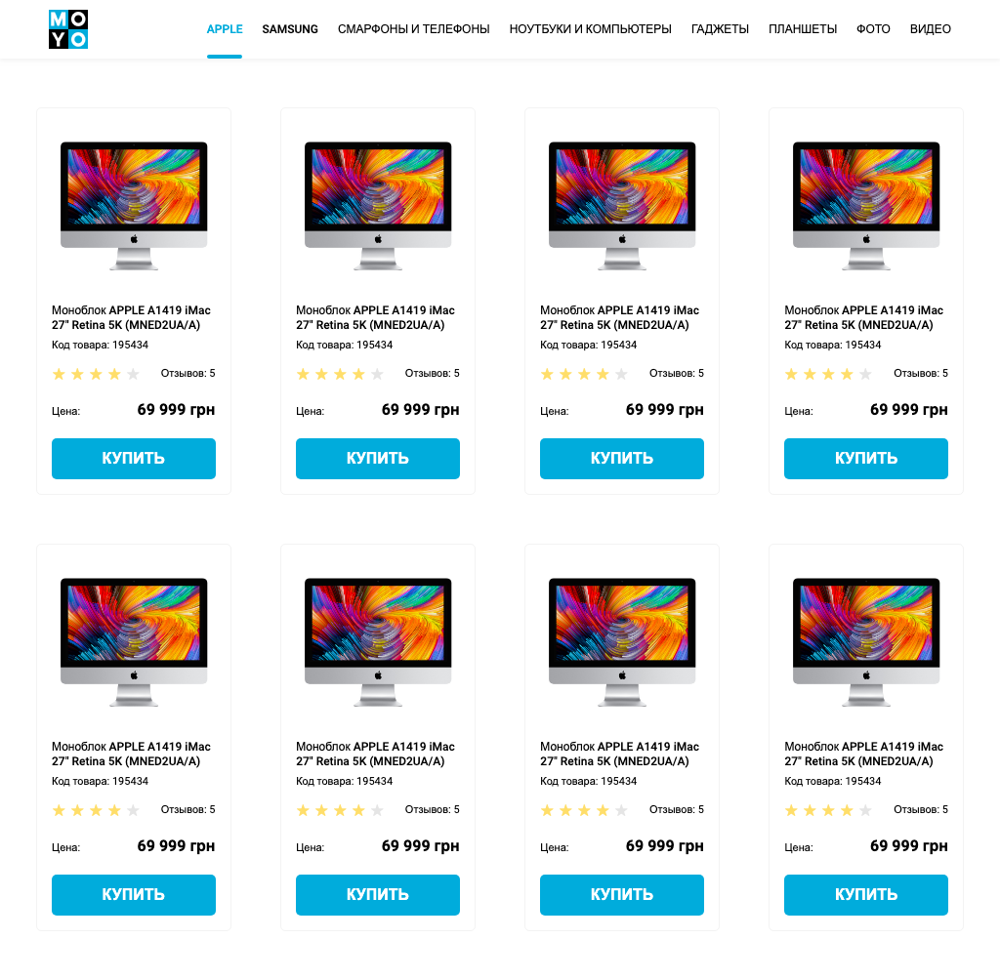

# Frontend practice with catalog page
- [DEMO LINK](https://MykhailoShchuka.github.io/layout_catalog/)

## Technologies used:
- HTML5
- SCSS
- BEM methodology

## The task
Create HTML page with catalog. Develop semantic page structure as shown on [the mockup](https://www.figma.com/file/zoFyK6rKrTwCCfKcqjkjnA/Moyo-%2F-Catalog?node-id=0%3A1).

## Requirements:
- use BEM and SCSS
- there should always be 4 cards in a row (not 2, 3 or 5)
  - use `:nth-child(4n)` to select every 4th element
  - use `:nth-last-child(-n + 4)` to select 4 last elements
- cards should have fixed width and fixed distances between them
- cards container should have fixed paddings (see 1024px example), bottom the same as top
- use semantic tags. `<header>`, `<nav>`, `<main>`
- add class `is-active` to the first link (`Apple`) in navigation

---

---
### Tips & Hints
Don't use flex `gap` property, it's not yet supported by tests.
